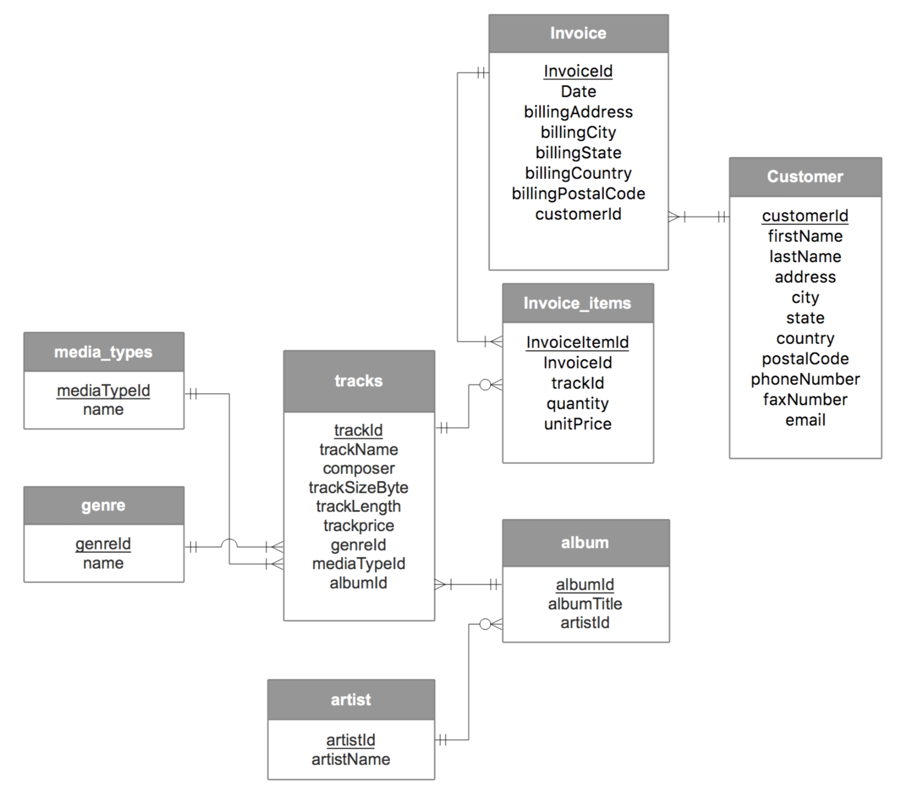

# MSiA 413 Homework 5

The first part of this project answers various questions about the Entertainment Agency Dataset.

Part 2 loads data about a music store from a CSV file into a single table in a new SQLite database. A series of CREATE and INSERT statements in the [create_populate_musicstore.sql](create_populate_musicstore.sql) file move the data into a normalized schema as [illustrated below](#Normalization)

## Getting started

If you do not already have Python installed, first [do so here](https://www.anaconda.com/download/).

Clone this repository or download the source code.

Loader relies on **pandas**, which can be downloaded with

```shell
pip install pandas
```

## Usage

From the command line, navigate to the project directory (`path/to/DB-HW5/`)

```shell
python3 loader.py
```

This command will execute a python script that will load in the original CSV file and create a SQLite database file in the current directory called `MusicStore.db`  
The included `create_populate_musicstore.sql` file will normalize the wide-format data in `hw5_original` table.

To continue the process, you can execute this file and explore the resultant tables from the command line using sqlite3

```shell
$ sqlite3 MusicStore.db
sqlite> .read create_populate_musicstore.sql
sqlite> .tables
sqlite> .fullschema
sqlite>
```

The last question in part 2 may be answered with the following query

```SQL
SELECT a2.artistName, round(SUM(i.quantity * i.unitPrice), 2) netBread
FROM invoice_item i
JOIN track t on i.trackID = t.trackID
JOIN album a on t.albumID = a.albumID
JOIN artist a2 on a.artistID = a2.artistID
GROUP BY a2.artistID
ORDER BY netBread DESC
LIMIT 3;
```

Which shows the top 3 artists as:

```text
Iron Maiden|138.6
U2|105.93
Metallica|90.09
```

## Data

The data used represents the activity of an international music store. The data is taken from a [SQLite Tutorial](http://www.sqlitetutorial.net/sqlite-sample-database/); however, the data has been combined into a single, wide-format table and exported to a csv titled [hw5_original.csv](hw5_original.csv).

The structure is as follows:

- TrackName
- Composer
- TrackLength
- TrackSizeBytes
- TrackPrice
- Genre
- MediaType
- AlbumTitle
- ArtistName
- InvoiceItemQuantity
- InvoiceItemUnitPrice
- InvoiceId
- InvoiceDate
- InvoiceBillingAddress
- InvoiceBillingCity
- InvoiceBillingState
- InvoiceBillingCountry
- InvoiceBillingPostalCode
- CustomerFirstName
- CustomerLastName
- CustomerAddress
- CustomerCity
- CustomerState
- CustomerCountry
- CustomerPostalCode
- CustomerPhone
- CustomerFax
- CustomerEmail

## Normalization

The database is subject to the following constraints:

- Artist names, customer last names and invoice IDs are unique
- Each artist can have zero or more albums
- Each album is made by exactly one artist
- Each track appears in exactly one album. Note that some tracks with the same name from the same composer may appear in different albums; in that case, however, they have different lengths, so they are considered different tracks (i.e., the tuple &lttrackName, trackLength&gt is unique for each track)
- Each album has at least one track
- Each track belongs to exactly one genre
- Each genre is represented by at least one track
- Each track is stored in exactly one media type
- Each media type is used by at least one track
- Each invoice item is for exactly one track and part of exactly one invoice
- Each invoice has at least one invoice item
- Some tracks may have never been sold (so there are no invoices for them)
- Each invoice is issued to exactly one customer
- The following columns always have a value:
  - album
  - title
  - customer first and last name
  - customer email
  - track name
  - track price
  - track length
  - invoice date
  - invoice item unit price
  - invoice item quantity


